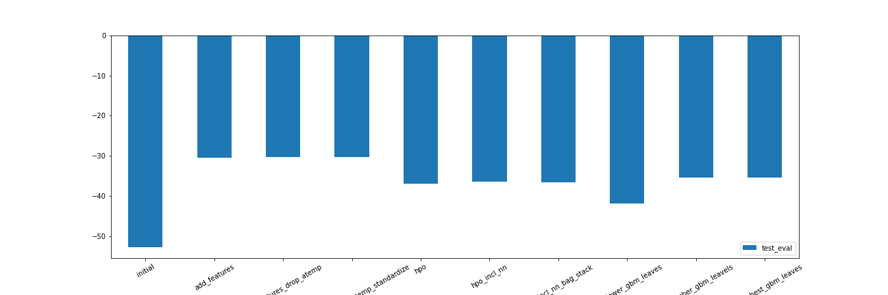
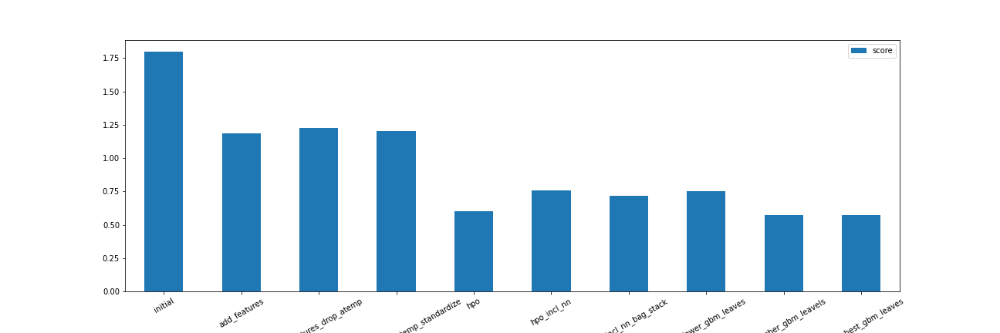

# Report: Predict Bike Sharing Demand with AutoGluon Solution
#### Devin Clarke

## Initial Training
### What did you realize when you tried to submit your predictions? What changes were needed to the output of the predictor to submit your results?
I noted when iterating on hyperparameter optimisation that some of the predictions from the best AutoGluon models provided negative predictions. I had to set these to 0 in order to submit them to Kaggle.

### What was the top ranked model that performed?
The WeightedEnsemble_L2 was the best performer. This model weights outputs from an ensemble of other models according to their performance and uses these weighted outputs to generate a final prediction.

## Exploratory data analysis and feature creation
### What did the exploratory analysis find and how did you add additional features?
EDA highlighted the high correlation between the 'temp' and 'atemp' features, and overall low levels of correlation between the target and our continuous features. The distribution of the target seemed to vary quite highly across different levels of weather, holiday, and workingday values.

I added additional features by pulling day, month, and hour values from the 'datetime' feature. I additionally generated a feature capturing whether the 'hour' fell within working hours, and then a feature capturing the interaction between the binary working hour feature and the binary working day feature.

### How much better did your model preform after adding additional features and why do you think that is?
The model performed drastically better. The improvement in evaluation metric was from -52.860858 to -30.446104, and the kaggle score moved from 1.79652 to 1.18505. Setting features to the correct type (e.g. categorical) no doubt helped, and given the difference in the target distribution between levels of working hour and working hour x working day, I anticipate this new feature helped predictive power as well.

## Hyper parameter tuning
### How much better did your model preform after trying different hyper parameters?
This also added an enormous improvement. Whilst the evaluation metric actually got worse (from -30.446104 to -35.506805) the score against the kaggle dataset improved from 1.18505 to 0.57482.

### If you were given more time with this dataset, where do you think you would spend more time?
I would iterate further on the winning model (WeightedEnsemble_L2) and continue to tune hyperparameters. I'd identify which features provided the greatest predictive power and experiment with introducing new features that capture interactions between existing features.

### Create a table with the models you ran, the hyperparameters modified, and the kaggle score.
|model|hpo1|hpo2|hpo3|hpo4|score|
|--|--|--|--|--|
|initial|None|None|None|None|1.79652|
|add_features|None|None|None|None|1.18505|
|hpo|GBM Leaves 13-26|GBM Leaves 26-66|GBM Leaves 66-100|GBM Leaves 100-200|0.57482|

### Create a line plot showing the top model score for the three (or more) training runs during the project.

### Create a line plot showing the top kaggle score for the three (or more) prediction submissions during the project.

## Summary

The addition of new features (such as the interaction between workday and working hours) and the correct categorisation of others (e.g. weather as a category) drastically improved model performance. However the greatest gain was achieved through hyperparameter optimisation. Note that the hyperparameter search spaces I explicitly states were for neural network and GBM models, though consistently these were outperformed by the WeightedEnsemble models. I believe simply enabling HPO for AutoGluon is what drove this performance gain rather than any explicit hyperparameters I dictated.
